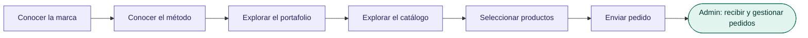
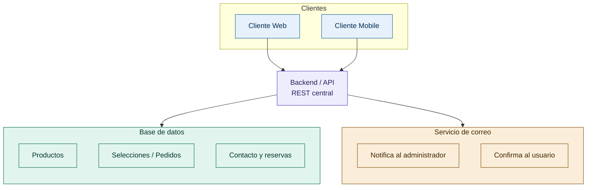

# GOD LAB 2026 💄


Plataforma web y aplicación móvil para presentar la marca, el método de trabajo y el portafolio de una marca de maquillaje, junto con un catálogo de productos donde el usuario puede buscar, filtrar, seleccionar y enviar su selección como solicitud de pedido.

---

## 📋 Tabla de contenidos

- [Descripción general](#descripción-general)
- [Características principales](#características-principales)
- [Arquitectura](#arquitectura)
- [Tecnologías](#tecnologías)
- [Metodología de trabajo](#metodología-de-trabajo)
- [Roles del equipo](#roles-del-equipo)
- [Backlog: épicas, historias y requisitos](#backlog-épicas-historias-y-requisitos)
- [Sprints](#sprints)
- [Estructura del proyecto](#estructura-del-proyecto)
- [Instalación y ejecución](#instalación-y-ejecución)
- [Variables de entorno](#variables-de-entorno)
- [Pruebas](#pruebas)
- [Documentación adicional](#documentación-adicional)

---

## Descripción general

El proyecto está compuesto por **dos clientes** (Web y Mobile) que consumen un **backend/API central**, garantizando que el catálogo, el portafolio y las selecciones de los usuarios estén siempre sincronizados sin importar desde qué plataforma se originó la acción.

El flujo principal del usuario es:



## Características principales

- 🔍 Búsqueda, filtrado (colores y demás opciones) y ordenamiento de productos en el catálogo.
- 🎨 Interfaces rediseñadas para marca, método, portafolio, catálogo, contacto y reservas.
- 💬 Pop-up de WhatsApp y footer mejorado en la página principal.
- 🛍️ Selección de productos de maquillaje dentro del portafolio/catálogo.
- 📤 Envío de la selección como solicitud de pedido, con confirmación al usuario.
- 📧 Notificación automática al correo del administrador por cada pedido recibido.
- 📱 Aplicación móvil del portafolio, consumiendo la misma API que la web.

## Arquitectura



Web y Mobile son clientes independientes que consumen el mismo backend: cualquier regla de negocio (filtros, selección, envío de pedidos) se implementa una sola vez y se refleja en ambas plataformas.

## Tecnologías

> Ajustar esta sección según las tecnologías definitivas que el equipo decida utilizar.

| Capa | Tecnología sugerida |
|---|---|
| Frontend Web | *(a definir, ej. React / Vue / Angular)* |
| Frontend Mobile | *(a definir, ej. React Native / Flutter)* |
| Backend / API | *(a definir, ej. Node.js + Express / Django / Spring Boot)* |
| Base de datos | Motor relacional (ej. PostgreSQL / MySQL) |
| Envío de correo | Servicio SMTP o proveedor externo (ej. SendGrid) |
| Control de versiones | Git + GitHub |
| Gestión ágil | Tablero Scrum (ej. Jira / Trello / GitHub Projects) |

## Metodología de trabajo

El proyecto se desarrolla bajo **Scrum**:

- **Sprint Planning:** selección de historias/requisitos del backlog priorizado al inicio de cada sprint.
- **Daily Scrum:** seguimiento diario de avances y bloqueos.
- **Sprint Review:** presentación del incremento funcional al cierre de cada sprint.
- **Sprint Retrospective:** mejora continua del proceso del equipo.

El backlog completo está organizado como **épicas → historias de usuario / requisitos funcionales y no funcionales → sprints**, y visualizado mediante un [User Story Mapping](./User_Story_Mapping.md).

## Roles del equipo

| Integrante | Rol | Responsabilidad principal |
|---|---|---|
| Juan Manuel | Scrum Master / Frontend | Facilita el proceso Scrum y desarrolla la interfaz web. |
| Francisco Molina | Mobile Engineer | Desarrollo de la aplicación móvil del portafolio y selección de productos. |
| Danilo Carlosama | Tester QA | Pruebas funcionales, validación de criterios de aceptación y detección de errores. |

> ⚠️ El equipo no tiene asignado explícitamente un rol de **Backend Developer**. Se recomienda definirlo antes de iniciar el desarrollo de la API central y la base de datos.

## Backlog: épicas, historias y requisitos

| Épica | Historias / Requisitos |
|---|---|
| Catálogo de Productos | HU01, HU02, HU08 |
| Contacto y Reservas | HU06, HU07 |
| Páginas Institucionales (Marca y Método) | HU03, HU04 |
| Portafolio | HU05, HU09 |
| Componentes Globales / Navegación | HU10 |
| Selección y Gestión de Pedidos | RF-01 a RF-07, RNF-01 a RNF-07 |

**Leyenda:** `HUxx` = Historia de Usuario · `RF-xx` = Requisito Funcional · `RNF-xx` = Requisito No Funcional

## Sprints

| Sprint | Objetivo | Alcance |
|---|---|---|
| Sprint 1 | Corrección de bugs y revisión de errores adicionales | HU01, HU02, HU07 |
| Sprint 2 | Mejoras de diseño e interfaz gráfica | HU03, HU04, HU05, HU06, HU08 |
| Sprint 3 | Componentes globales y base de selección de productos | HU10, RF-01, RF-02 |
| Sprint 4 | Envío de selección, notificación al admin y app móvil | RF-03 a RF-07, HU09 |

## Estructura del proyecto

```
├── web/                # Cliente web
├── mobile/             # Aplicación móvil
├── backend/            # API REST central
├── docs/
│   ├── Plan_de_Proyecto_Metodologia.pdf
│   └── User_Story_Mapping.md
└── README.md
```

## Instalación y ejecución

> Completar los comandos reales una vez definido el stack técnico.

```bash
# Clonar el repositorio
git clone https://github.com/usuario/nombre-del-repo.git
cd nombre-del-repo

# Backend
cd backend
npm install
npm run dev

# Web
cd ../web
npm install
npm run dev

# Mobile
cd ../mobile
npm install
npm run start
```

## Variables de entorno

Crear un archivo `.env` en `backend/` con al menos las siguientes variables:

```env
DATABASE_URL=
ADMIN_EMAIL=
SMTP_HOST=
SMTP_USER=
SMTP_PASSWORD=
```

## Pruebas

Cada historia de usuario y requisito debe validarse contra sus **criterios de aceptación** antes del cierre del sprint (responsable: QA). Se recomienda documentar los casos de prueba en `docs/` o en la herramienta de
